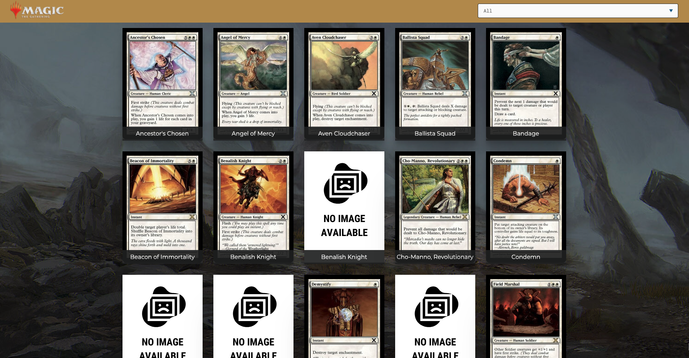
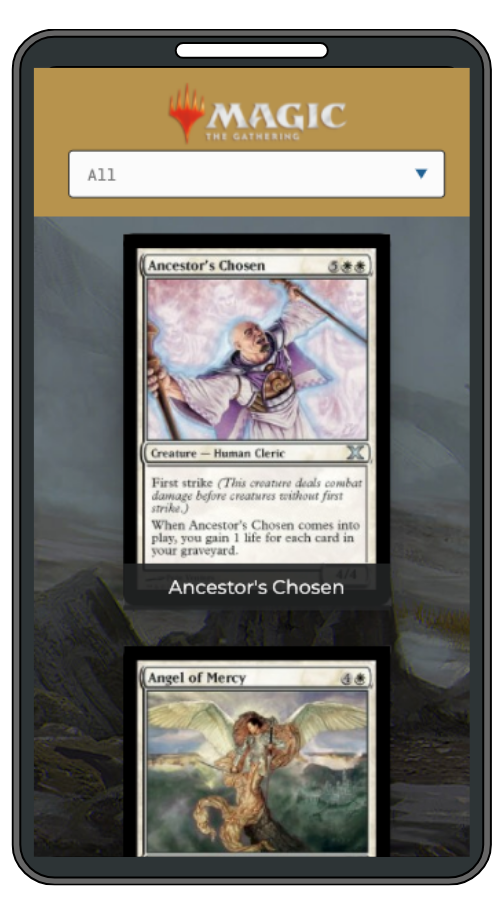

# Magic Cards Catalogue

> A catalog of Magic cards.

This project is part of the Microverse curriculum "React & Redux." 

This project is the final for this module. It is a catalog of the "Magic card game" cards. 

The project was built with React and Redux. A list of cards is displayed on it. Cards can be filtered by their type. Each can be accessed for more information.

 

 
 

## Live Version

[Live version here!](https://magic-compendium.herokuapp.com)

## Prerequisites

- [Node.js](https://nodejs.org/en/) installed.
- Vs Code

## Getting Started

To get a local copy up and running, follow these simple example steps.

- At first, you have to clone this repository. Open your terminal and paste this without the $ sign.

      $ git clone https://github.com/AlejandroNo4/react-capstone.git

- Now that you have the repository in your local machine. Change the direction of the local file with your terminal. Just type "$ cd" (without the $ sign) and the path to reach the react-capstone folder. 
  Something like:

      $ cd User/Documents/react-capstone

- Now run 

      $npm install

- You are done with the installations! Now to run the project, first type:

      $ npm start

- This will automatically open the app on your browser.

 

## Built With

- Javascript
- VS Code
- Git
- HTML
- React
- Redux
- JSX

## Author

👤 **Author1**

- GitHub: [@AlejandroNo4](https://github.com/AlejandroNo4)
- Twitter: [@Alejand80002666](https://twitter.com/Alejand80002666)
- LinkedIn: [Alejandro Contreras Rodriguez](https://www.linkedin.com/in/alejandro-contreras-rodriguez-b524821b5)

## 🤝 Contributing

Contributions, issues, and feature requests are welcome!

Feel free to check the [Issues page](https://github.com/AlejandroNo4/react-capstone/issues).

## Show your support

Give a ⭐️ if you like this project!

## Acknowledgments 🙌🏽

- Design inspired by [Marc-Antoine Roy](https://www.behance.net/gallery/11351281/NomNom)
- Background loading art by [Sean Evans](https://www.artstation.com/seanevans)
- Main Background by [Kasia 'Kafis' Zielińska](https://www.artstation.com/kafis)

## 📝 License

This project is [MIT](./MIT.md) licensed.
